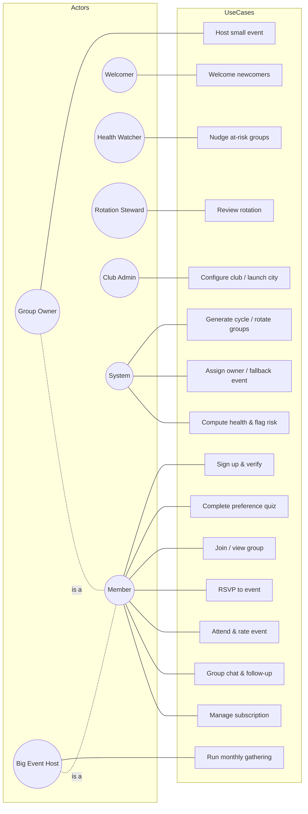
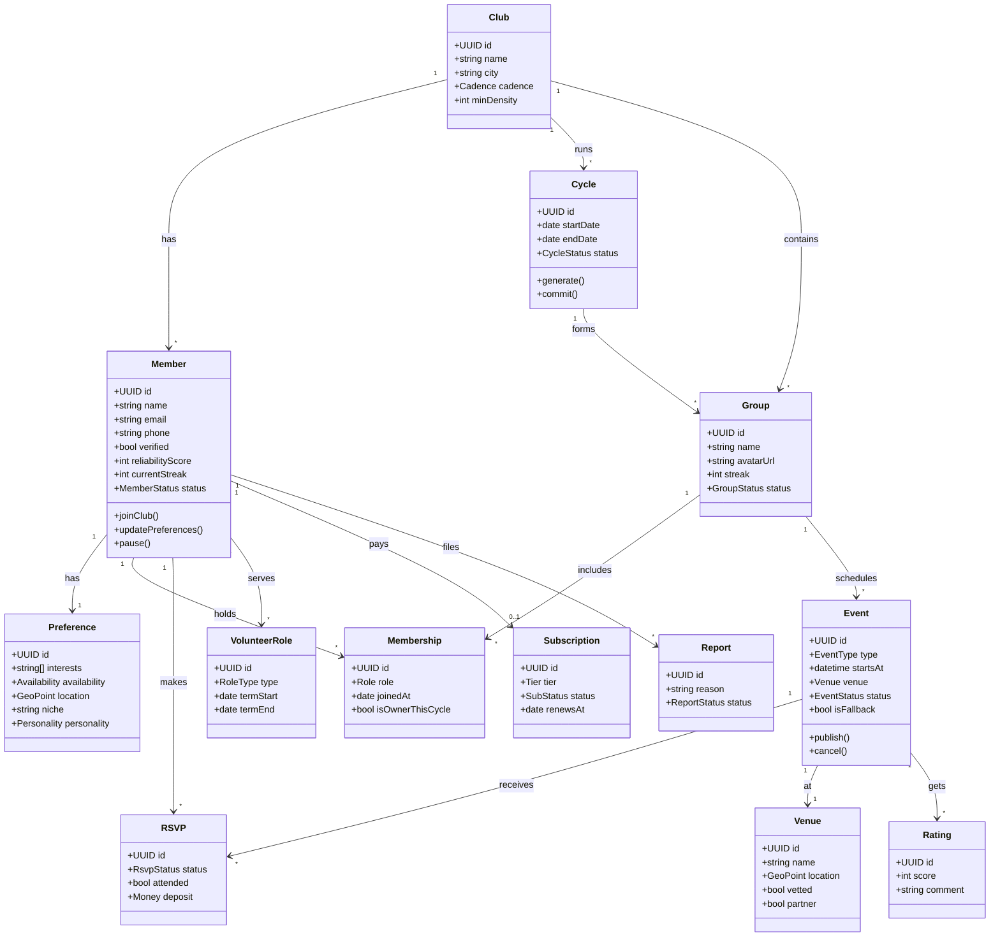
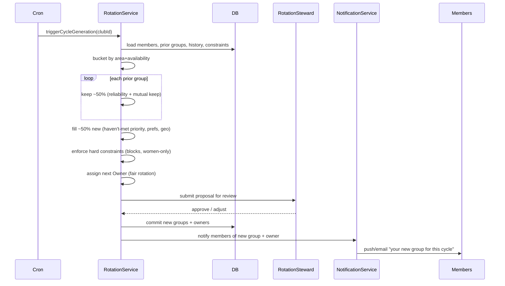
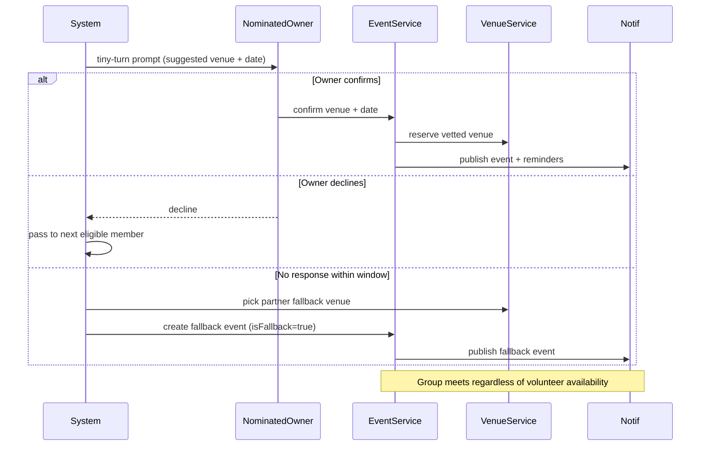
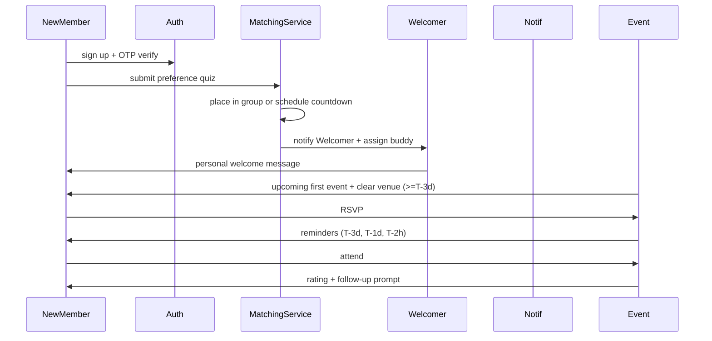
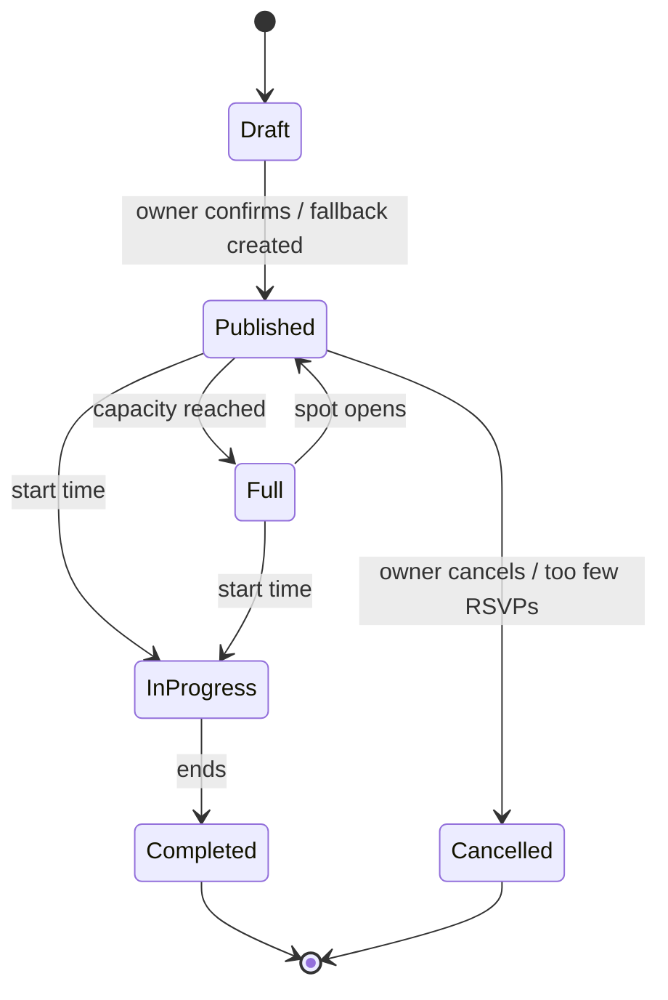
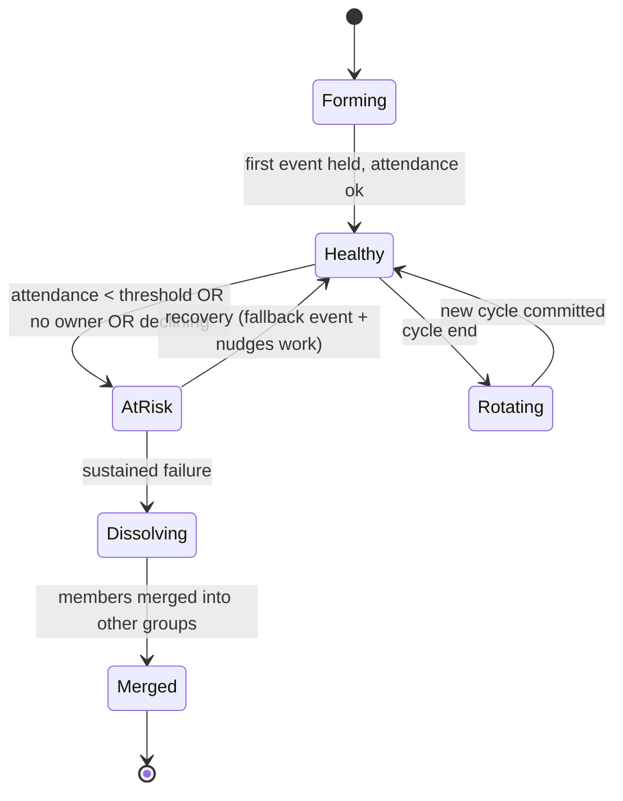
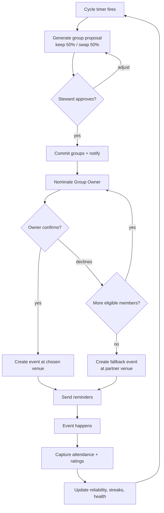
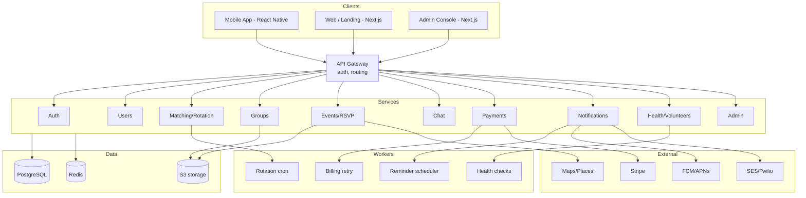

# 06 — UML Diagrams

*All diagrams in Mermaid (renders on GitHub, VS Code with Mermaid extension, mermaid.live). Covers: use case, class, sequence (×3), state, activity, and component diagrams. The ER diagram lives in doc 07.*

---

## 1. Use Case Diagram

---

## 2. Class / Domain Model

---

## 3. Sequence — Cycle rotation (UC-02)

---

## 4. Sequence — Rotating ownership with fallback (UC-03)

---

## 5. Sequence — Member first event (UC-01)

---

## 6. State — Event lifecycle

---

## 7. State — Group health

---

## 8. Activity — Cycle + ownership + fallback (end to end)

---

## 9. Component / Deployment

