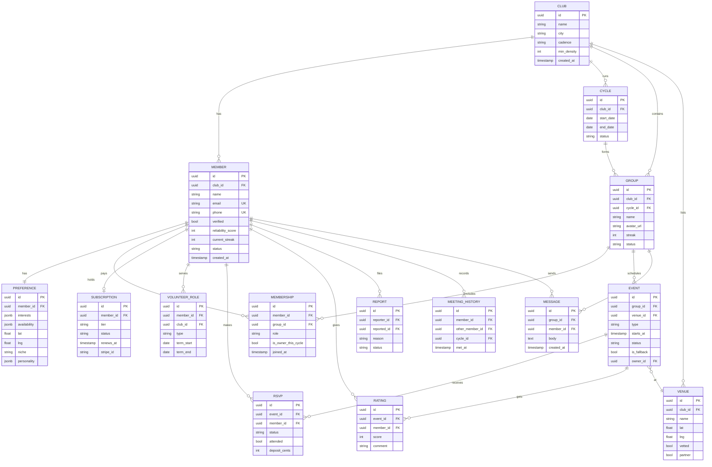

# 07 — Database Design

*PostgreSQL relational schema for Orbit. Covers ER diagram, table definitions, key relationships, indexes, and the queries that power the core loops. The relational model fits Orbit well because groups/cycles/memberships/RSVPs are inherently relational and need transactional integrity.*

---

## 1. ER Diagram



---

## 2. Table definitions (DDL)

```sql
-- ENUM types
CREATE TYPE member_status AS ENUM ('active','paused','banned','pending');
CREATE TYPE group_status  AS ENUM ('forming','healthy','at_risk','dissolving','merged','rotating');
CREATE TYPE cycle_status  AS ENUM ('planned','proposed','committed','closed');
CREATE TYPE event_type    AS ENUM ('small','big');
CREATE TYPE event_status  AS ENUM ('draft','published','full','in_progress','completed','cancelled');
CREATE TYPE rsvp_status   AS ENUM ('going','waitlist','declined','no_show');
CREATE TYPE member_role   AS ENUM ('member','owner');
CREATE TYPE volunteer_type AS ENUM ('big_event_host','welcomer','health_watcher','rotation_steward');
CREATE TYPE sub_tier      AS ENUM ('free','plus');
CREATE TYPE sub_status    AS ENUM ('active','past_due','cancelled');

CREATE TABLE club (
    id           uuid PRIMARY KEY DEFAULT gen_random_uuid(),
    name         text NOT NULL,
    city         text NOT NULL,
    cadence      text NOT NULL DEFAULT 'biweekly+monthly',
    min_density  int  NOT NULL DEFAULT 30,
    created_at   timestamptz NOT NULL DEFAULT now()
);

CREATE TABLE member (
    id                uuid PRIMARY KEY DEFAULT gen_random_uuid(),
    club_id           uuid NOT NULL REFERENCES club(id),
    name              text NOT NULL,
    email             citext UNIQUE NOT NULL,
    phone             text UNIQUE,
    verified          boolean NOT NULL DEFAULT false,
    reliability_score int NOT NULL DEFAULT 100,   -- 0..100
    current_streak    int NOT NULL DEFAULT 0,
    status            member_status NOT NULL DEFAULT 'pending',
    created_at        timestamptz NOT NULL DEFAULT now()
);

CREATE TABLE preference (
    id           uuid PRIMARY KEY DEFAULT gen_random_uuid(),
    member_id    uuid NOT NULL UNIQUE REFERENCES member(id) ON DELETE CASCADE,
    interests    jsonb NOT NULL DEFAULT '[]',
    availability jsonb NOT NULL DEFAULT '{}',      -- {mon:[...], tue:[...]}
    lat          double precision,
    lng          double precision,
    niche        text,
    personality  jsonb NOT NULL DEFAULT '{}'
);

CREATE TABLE cycle (
    id         uuid PRIMARY KEY DEFAULT gen_random_uuid(),
    club_id    uuid NOT NULL REFERENCES club(id),
    start_date date NOT NULL,
    end_date   date NOT NULL,
    status     cycle_status NOT NULL DEFAULT 'planned'
);

CREATE TABLE "group" (
    id         uuid PRIMARY KEY DEFAULT gen_random_uuid(),
    club_id    uuid NOT NULL REFERENCES club(id),
    cycle_id   uuid NOT NULL REFERENCES cycle(id),
    name       text NOT NULL,
    avatar_url text,
    streak     int NOT NULL DEFAULT 0,
    status     group_status NOT NULL DEFAULT 'forming'
);

CREATE TABLE membership (
    id                  uuid PRIMARY KEY DEFAULT gen_random_uuid(),
    member_id           uuid NOT NULL REFERENCES member(id) ON DELETE CASCADE,
    group_id            uuid NOT NULL REFERENCES "group"(id) ON DELETE CASCADE,
    role                member_role NOT NULL DEFAULT 'member',
    is_owner_this_cycle boolean NOT NULL DEFAULT false,
    joined_at           timestamptz NOT NULL DEFAULT now(),
    UNIQUE (member_id, group_id)
);

CREATE TABLE venue (
    id       uuid PRIMARY KEY DEFAULT gen_random_uuid(),
    club_id  uuid NOT NULL REFERENCES club(id),
    name     text NOT NULL,
    lat      double precision,
    lng      double precision,
    vetted   boolean NOT NULL DEFAULT false,
    partner  boolean NOT NULL DEFAULT false
);

CREATE TABLE event (
    id         uuid PRIMARY KEY DEFAULT gen_random_uuid(),
    group_id   uuid NOT NULL REFERENCES "group"(id) ON DELETE CASCADE,
    venue_id   uuid REFERENCES venue(id),
    owner_id   uuid REFERENCES member(id),
    type       event_type NOT NULL DEFAULT 'small',
    starts_at  timestamptz NOT NULL,
    status     event_status NOT NULL DEFAULT 'draft',
    is_fallback boolean NOT NULL DEFAULT false
);

CREATE TABLE rsvp (
    id           uuid PRIMARY KEY DEFAULT gen_random_uuid(),
    event_id     uuid NOT NULL REFERENCES event(id) ON DELETE CASCADE,
    member_id    uuid NOT NULL REFERENCES member(id) ON DELETE CASCADE,
    status       rsvp_status NOT NULL DEFAULT 'going',
    attended     boolean NOT NULL DEFAULT false,
    deposit_cents int NOT NULL DEFAULT 0,
    UNIQUE (event_id, member_id)
);

CREATE TABLE rating (
    id        uuid PRIMARY KEY DEFAULT gen_random_uuid(),
    event_id  uuid NOT NULL REFERENCES event(id) ON DELETE CASCADE,
    member_id uuid NOT NULL REFERENCES member(id),
    score     int NOT NULL CHECK (score BETWEEN 1 AND 5),
    comment   text
);

CREATE TABLE volunteer_role (
    id         uuid PRIMARY KEY DEFAULT gen_random_uuid(),
    member_id  uuid NOT NULL REFERENCES member(id),
    club_id    uuid NOT NULL REFERENCES club(id),
    type       volunteer_type NOT NULL,
    term_start date NOT NULL,
    term_end   date NOT NULL
);

CREATE TABLE subscription (
    id        uuid PRIMARY KEY DEFAULT gen_random_uuid(),
    member_id uuid NOT NULL UNIQUE REFERENCES member(id),
    tier      sub_tier NOT NULL DEFAULT 'free',
    status    sub_status NOT NULL DEFAULT 'active',
    renews_at timestamptz,
    stripe_id text
);

CREATE TABLE report (
    id          uuid PRIMARY KEY DEFAULT gen_random_uuid(),
    reporter_id uuid NOT NULL REFERENCES member(id),
    reported_id uuid NOT NULL REFERENCES member(id),
    reason      text NOT NULL,
    status      text NOT NULL DEFAULT 'open',
    created_at  timestamptz NOT NULL DEFAULT now()
);

CREATE TABLE message (
    id         uuid PRIMARY KEY DEFAULT gen_random_uuid(),
    group_id   uuid NOT NULL REFERENCES "group"(id) ON DELETE CASCADE,
    member_id  uuid NOT NULL REFERENCES member(id),
    body       text NOT NULL,
    created_at timestamptz NOT NULL DEFAULT now()
);

-- Powers the "haven't-met" anti-clique priority in matching
CREATE TABLE meeting_history (
    id              uuid PRIMARY KEY DEFAULT gen_random_uuid(),
    member_id       uuid NOT NULL REFERENCES member(id) ON DELETE CASCADE,
    other_member_id uuid NOT NULL REFERENCES member(id) ON DELETE CASCADE,
    cycle_id        uuid NOT NULL REFERENCES cycle(id),
    met_at          timestamptz NOT NULL DEFAULT now(),
    UNIQUE (member_id, other_member_id, cycle_id)
);

-- Blocked pairs (safety hard constraint in matching)
CREATE TABLE block (
    id          uuid PRIMARY KEY DEFAULT gen_random_uuid(),
    member_id   uuid NOT NULL REFERENCES member(id) ON DELETE CASCADE,
    blocked_id  uuid NOT NULL REFERENCES member(id) ON DELETE CASCADE,
    UNIQUE (member_id, blocked_id)
);
```

---

## 3. Indexes

```sql
CREATE INDEX idx_member_club        ON member(club_id);
CREATE INDEX idx_member_status      ON member(status);
CREATE INDEX idx_membership_group   ON membership(group_id);
CREATE INDEX idx_membership_member  ON membership(member_id);
CREATE INDEX idx_group_cycle        ON "group"(cycle_id);
CREATE INDEX idx_event_group        ON event(group_id);
CREATE INDEX idx_event_starts       ON event(starts_at);
CREATE INDEX idx_rsvp_event         ON rsvp(event_id);
CREATE INDEX idx_rsvp_member        ON rsvp(member_id);
CREATE INDEX idx_meeting_member     ON meeting_history(member_id);
CREATE INDEX idx_message_group_time ON message(group_id, created_at DESC);
-- Geo prefilter for matching (or use PostGIS for real distance)
CREATE INDEX idx_pref_geo           ON preference(lat, lng);
```

> For production geo matching, enable **PostGIS** and store `geography(Point)` on `preference` and `venue` for true radius queries.

---

## 4. Key relationships explained

- **Cycle → Group → Membership**: groups are *per cycle*. Rotation creates a fresh set of `group` rows each `cycle`, and `membership` rows link members to that cycle's group. This makes rotation a clean insert (not a mutation of long-lived groups) and gives full history.
- **meeting_history**: the anti-clique engine. Before filling a group, matching queries who each member has already met to prioritize *new* pairings (implements FR-12).
- **block**: hard safety constraint — matching must never place blocked pairs together (FR-13).
- **event.is_fallback + owner_id nullable**: supports the auto-run fallback (FR-23) — a fallback event has no member owner.
- **membership.is_owner_this_cycle**: drives fair owner rotation (FR-20), combined with historical ownership lookups.

---

## 5. Queries that power the core loops

**A. Eligible members for a cycle (by area + availability):**
```sql
SELECT m.id, p.lat, p.lng, p.availability, m.reliability_score
FROM member m
JOIN preference p ON p.member_id = m.id
WHERE m.club_id = $1 AND m.status = 'active';
```

**B. Who has member X already met (anti-clique):**
```sql
SELECT other_member_id
FROM meeting_history
WHERE member_id = $1;
```

**C. Prior-cycle group for continuity (keep ~50%):**
```sql
SELECT ms.member_id, m.reliability_score
FROM membership ms
JOIN "group" g ON g.id = ms.group_id
JOIN member m  ON m.id = ms.member_id
WHERE g.cycle_id = $prevCycle AND g.id = $priorGroup;
```

**D. Fair next-owner (not owner recently):**
```sql
SELECT ms.member_id
FROM membership ms
JOIN member m ON m.id = ms.member_id
WHERE ms.group_id = $group
  AND m.status = 'active'
  AND ms.member_id NOT IN (
     SELECT owner_id FROM event WHERE group_id IN (
        SELECT id FROM "group" WHERE cycle_id = $prevCycle
     ) AND owner_id IS NOT NULL
  )
ORDER BY m.reliability_score DESC
LIMIT 1;
```

**E. Group health inputs (attendance rate last N events):**
```sql
SELECT g.id,
       AVG(CASE WHEN r.attended THEN 1 ELSE 0 END)::float AS attendance_rate,
       COUNT(DISTINCT e.id) AS events
FROM "group" g
JOIN event e ON e.group_id = g.id AND e.status = 'completed'
LEFT JOIN rsvp r ON r.event_id = e.id
WHERE g.club_id = $1
GROUP BY g.id;
```

**F. Update reliability + streak after an event:**
```sql
-- attended
UPDATE member SET reliability_score = LEAST(100, reliability_score + 2),
                  current_streak = current_streak + 1
WHERE id = ANY($attended_ids);
-- no-show
UPDATE member SET reliability_score = GREATEST(0, reliability_score - 10),
                  current_streak = 0
WHERE id = ANY($no_show_ids);
```

---

## 6. Data lifecycle & integrity notes
- **Transactions**: cycle commit (create groups + memberships + owner assignment + meeting_history) runs in one transaction; partial failure rolls back.
- **Idempotency**: rotation keyed by `cycle_id`; re-running a committed cycle is a no-op (NFR-04).
- **Soft state vs history**: groups/memberships are immutable per cycle → natural audit trail; no destructive edits.
- **Privacy (NFR-06)**: `ON DELETE CASCADE` from `member` supports right-to-be-forgotten; export via a per-member join query.
- **PII minimization**: only email/phone are sensitive; personality/prefs are behavioral, not identifying.
